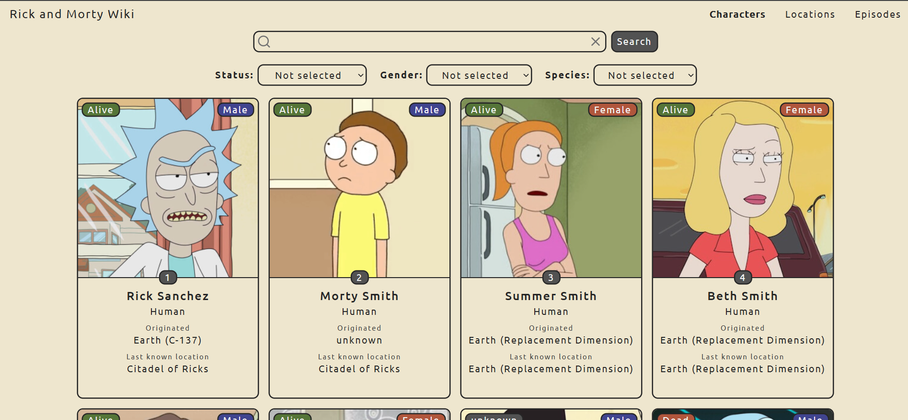

# Rick and Morty Wiki

A responsive single-page wiki for browsing characters, locations, and episodes from the Rick and Morty universe. The app uses the public [Rick and Morty API](https://rickandmortyapi.com/documentation) to fetch data dynamically via API requests for searching, filtering, and pagination, providing a clean client-side interface for exploring characters and their related entities.



## 🔗 Links

**Live Demo:** [View Live Site](https://rick-and-morty-wiki-app.vercel.app/)  
**GitHub Repository:** [View Source Code](https://github.com/iviktorry/rick-and-morty-wiki)

---

## Features

## Features

- **Home page:** entry points to the character, location, and episode sections, each with a local category image.
- **Character browser:** paged character cards with portrait, ID, name, status, gender, species, origin, and last known location.
- **Character search:** submits a name query as server-side URL parameters directly to the API; the clear control resets the query parameters and returns to page one.
- **Character filters:** sends combined status, gender, and species filter parameters as API queries. Updating any filter triggers a new API request and resets pagination to page one.
- **Locations:** page through locations fetched from the API, choose one from the current page, and view its type and resident character cards.
- **Episodes:** page through episodes fetched from the API, choose one from the current page, and view its episode code, title, and character cards.
- **Pagination:** previous/next controls and a sliding window of up to five page numbers, requesting the corresponding page data directly from the server.
- **Navigation and fallback:** React Router links between sections, active navigation styling, and a custom not-found page with a return-home link.
- **Loading and error feedback:** the character directory shows loading, error, and empty-result states based on API responses. Location and episode pages track list and selected-item loading separately, report request errors, and show loading, error, or empty states for related character cards.
- **Responsive layout:** Tailwind breakpoints adjust navigation and data grids for smaller and larger screens.
- **Reduced motion:** the global stylesheet disables transitions when the user prefers reduced motion.
- **Page titles:** the document title is updated for the home page, data sections, and not-found route.

## Routes

| Path           | Page                                          |
| -------------- | --------------------------------------------- |
| `/`            | Home                                          |
| `/characters`  | Searchable and filterable character directory |
| `/locations`   | Location selector and resident characters     |
| `/episodes`    | Episode selector and episode characters       |
| Any other path | Not-found page                                |

## Tech Stack

### Application

- **TypeScript** & **React 19** (`react`, `react-dom`) — fully type-safe component-based UI rewritten from JSX to TSX for strict type safety across props, hooks, custom generics, and form events.
- **React Router DOM 7** — browser history, links, and declarative route matching. `BrowserRouter` wraps the app in `src/main.tsx`.
- **Vite 8** — local development server and production bundler, configured with `vite-env.d.ts` for static asset and media module declarations (e.g., `.gif` files).
- **Tailwind CSS 4** — utility-first styles, imported in `src/index.css` with `@import "tailwindcss"`.
- **Rick and Morty API** — external source for all character, location, and episode data. The app has no custom backend or database.
- **Lucide React** — the search and clear (`Search`, `X`) icons in the character search form.
- **Google Fonts (Ubuntu)** — font loaded from Google Fonts in `index.html`; an internet connection is needed to fetch it.

### Developer tools

- **ESLint 10** — linting through the flat config in `eslint.config.js`, with the recommended TypeScript and React rules.
- **Prettier Tailwind CSS plugin** (`prettier-plugin-tailwindcss`) — configured to sort Tailwind class names when Prettier runs.
- **Vercel rewrite** — `vercel.json` sends requests for app paths to `index.html`, allowing the client-side routes to load on a Vercel deployment.

## Getting Started

Install a current Node.js version and npm, then run:

```bash
npm install
npm run dev
```

## 👩‍💻 Developer Contacts & Socials

[](https://github.com/iviktorry)
[](https://www.frontendmentor.io/profile/iviktorry)
[](https://t.me/wsxxdfv)
[](https://linkedin.com/in/victoria-pratkina-b23834388)
